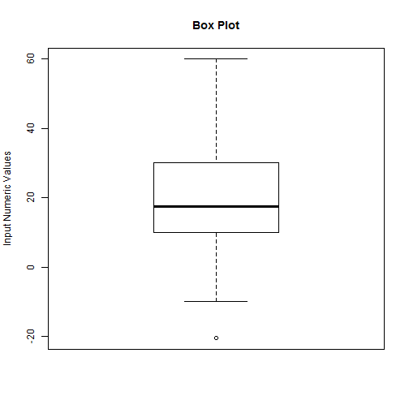

Number Summary, a Shiny Application
========================================================
author: The Presenter
date: Mon Aug 18 16:41:56 2014
transition: fade

Why Number Summary ?
========================================================

This shiny application hepls calculating number summary for a given list of numeric values

This is quite simple:
- Just enter your numbers in a text box
- Input numbers should be comma(,) seperated
- Immediately quantiles (summary) & Boxplot will be created

Pros: This is very handy for small amount of numeric values

Cons: Not suitable for large amount amount of numeric values

Example
========================================================
- Lets say we have 10 numbers to check their summary.

- Just enter them as below(comma seperate) for an example:
0,2,3,1,4,6,9,5,7,8

- The apps will show quantiles similar to below:


```
   Min. 1st Qu.  Median    Mean 3rd Qu.    Max. 
  -20.5    10.9    17.5    19.3    28.8    60.0 
```


Example (Cont.)
========================================================
- It will show the the corresponding boxplot as below:

 


Conclusion
========================================================

- It is very simple and easly to use
- It is free and opensource, just change as per your need
- Share it to as many people as you want
- Enjoy !

Application link(shinyapps.io):
http://obaid.shinyapps.io/shinyApps/

Source Code(github):
https://github.com/obaidcuet/DevelopingDataProducts/tree/master/shinyApps/
